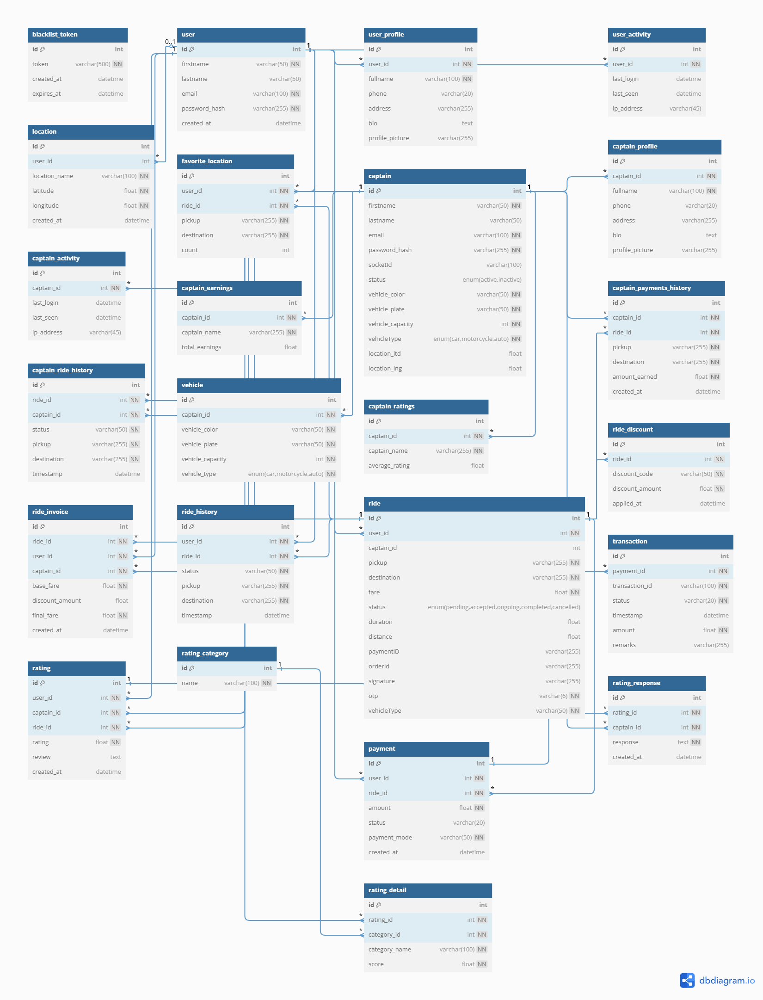

# Uber Clone – Database Schema Overview

This backend database consists of tables designed to support core functionalities of a ride-sharing application. Below is the detailed explanation grouped by **entities** and **functional domains**.

---

## 1. Users (Passengers)

- **user**  
  Stores registration data such as name, email, and password hash.

- **user_profile**  
  Contains extended details like full name, phone, address, bio, and profile picture.

- **user_activity**  
  Tracks user login/logout history, IP address, and last active time.

- **ride_history**  
  Logs past rides taken by the user including pickup, destination, and timestamp.

- **favorite_locations**  
  Maintains user’s most frequent pickup and drop points with count.

---

## 2. Captains (Drivers)

- **captain**  
  Stores captain's personal, login, and vehicle info. Includes active status and assigned location.

- **captain_profile**  
  Additional details like full name, phone, bio, address, and profile picture.

- **captain_activity**  
  Tracks last login, last seen, and IP address of the captain.

- **captain_earnings**  
  Total earnings per captain.

- **captain_ratings**  
  Aggregated average rating per captain.

- **captain_ride_history**  
  History of rides completed by captains with pickup, drop, and timestamps.

- **captain_payments_history**  
  Record of earnings per ride, including pickup, drop, and amount earned.

---

## 3. Vehicle

- **vehicle**  
  Stores all registered vehicle details like type, number, model, and captain association.
   
---

## 4. Rides & Locations

- **ride**  
  Main table capturing ride details: user, captain, pickup, destination, distance, duration, status, fare, OTP, vehicle type.

- **location**  
  Stores fixed location details (name, latitude, longitude) used for ride mapping.

---

## 5. Payments & Transactions

- **payment**  
  Payment made for a ride including amount, mode (cash/UPI/card), and status.

- **transaction**  
  Linked to payment, stores transaction ID, timestamp, status, and remarks.

- **ride_invoice**  
  Fare breakdown per ride – base fare, discount, final fare.

- **ride_discount**  
  Captures discount codes and applied amounts.

---

## 6. Ratings & Reviews

- **rating**  
  User's review and star rating for a ride.

- **rating_detail**  
  Category-wise breakdown (cleanliness, driving, punctuality) with scores.

- **rating_response**  
  Captain’s response to user ratings (optional feedback).

- **rating_category**  
  Category list used in detailed feedback (e.g., punctuality, safety).

---

## 7. Auth & Security

- **blacklist_token**  
  Tokens marked as expired/blacklisted for security and session management.

---

## ER Diagram

---

## Summary

| Category             | Tables Included                                                                 |
|----------------------|----------------------------------------------------------------------------------|
| Users                | user, user_profile, user_activity, ride_history, favorite_locations              |
| Captains             | captain, captain_profile, captain_activity, captain_earnings, captain_ratings, captain_ride_history, captain_payments_history |
| Vehicles             | vehicle                                                                   |
| Rides                | ride, location                                                                   |
| Payments             | payment, transaction, ride_invoice, ride_discount                                |
| Ratings              | rating, rating_detail, rating_response, rating_category                          |
| Security             | blacklist_token                                                                  |

---

